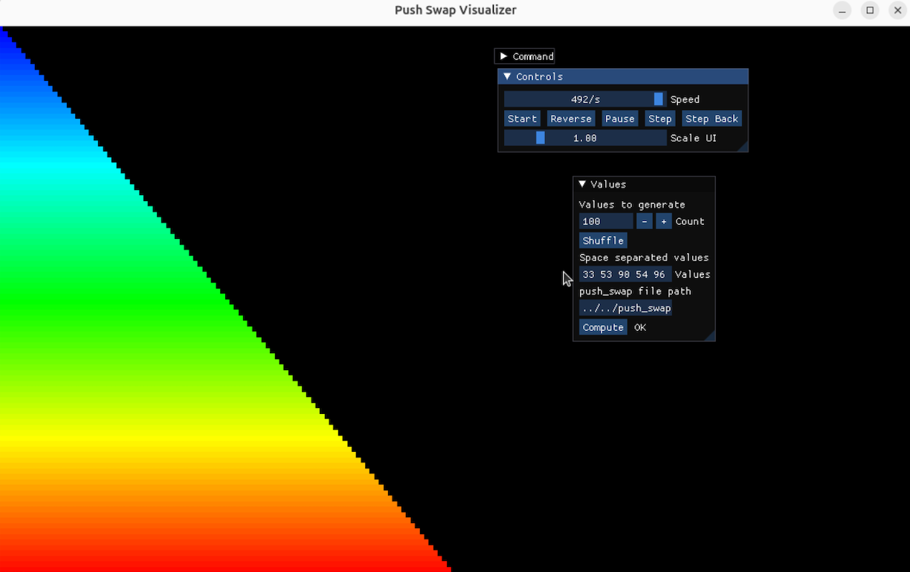

*This project has been created as part of the 42 curriculum by rabdolho.*

## Description
**push_swap** is a highly efficient C project that challenges students to sort a stack of integers using a limited set of instructions and a secondary stack. The goal is to find the smallest number of operations possible to transform an unsorted stack into a sorted one.

## Operations
Here are the operations that can be used and that you will have to code:
- **sa (swap a):** Swap the first 2 elements at the top of stack a. Does nothing if there is only one or none.
- **sb (swap b):** Swap the first 2 elements at the top of stack b. Does nothing if there is only one or none.
- **ss:** Perform both sa and sb at the same time.
- **pa (push a):** Takes the first element on top of b and puts it on a. Does nothing if b is empty.
- **pb (push b):** Takes the first element on top of a and puts it on b. Does nothing if a is empty.
- **ra (rotate a):** Shifts all the elements of stack a up by one position. The first element becomes the last.
- **rb (rotate b):** Shifts all the elements of stack b up by one position. The first element becomes the last.
- **rr:** Perform both ra and rb at the same time.
- **rra (reverse rotate a):** Shifts all the elements of stack a down by one position. The last element becomes the first.
- **rrb (reverse rotate b):** Shifts all the elements of stack b down by one position. The last element becomes the first.
- **rrr:** Perform both rra and rrb at the same time.

## Instruction
For this project, I implemented the Turk Algorithm. Unlike traditional Quicksort or Mergesort, this algorithm:

1. Pushes elements from Stack A to Stack B while maintaining a roughly sorted descending order in B.
2. Calculates the "cost" (number of operations) for each element in B to be placed in its correct position in A.
3. Executes the cheapest move until Stack B is empty.
4. Performs a final rotation to ensure the smallest element is at the top.

## Performance
The Turk Algorithm ensures that the move count remains well within the limits required for a perfect score. Below are the average results obtained during testing:
| Amount of Numbers | Average Move Count | 42 Threshold | Result |
|-------------------|--------------------|--------------|--------|
| **3 numbers**     | 2 – 3              | < 3          | ✅ Pass |
| **5 numbers**     | 8 – 11             | < 12         | ✅ Pass |
| **100 numbers**   | 550 – 650          | < 700        | ✅ Max Points |
| **500 numbers**   | 4800 – 5200        | < 5500       | ✅ Max Points |

## Features
- **Complexity:** Minimizing operations.
- **Sorting Algorithms:** Implementation of the "Turk Algorithm" for optimized pushes and rotations.
- **Data Structures:** Manipulation of doubly linked lists to represent stacks.
- **Efficiency:** Optimized instruction cost calculation (choosing the "cheapest" element to move).
- **Robust Error Handling:** Validates non-numeric input, integer overflows, and duplicate values.
- **Memory Management:** Zero memory leaks, verified via Valgrind.

## Visualizer Result
Below is a representation of the algorithm sorting 100 and 500 random integers. The "Turk Algorithm" efficiently moves elements between stacks to reach the sorted state with minimal instructions.



## Usage
### Compilation
The project includes a `Makefile` that compiles the source files into an executable named `push_swap`. To compile, run:
```bash
make
```
### Execution
```bash
./push_swap 3 1 2
# OR
ARG="4 67 3 87 23"; ./push_swap $ARG
```
### Cleanup
To remove object files, run:
```bash
make clean
```
OR to remore object files and the executable, run:
```bash
make fclean
```
## Resources
[Turk Algorithm](https://pure-forest.medium.com/push-swap-turk-algorithm-explained-in-6-steps-4c6650a458c0
)
[Doubly Linked List](https://www.geeksforgeeks.org/dsa/doubly-linked-list/)
[Stack and Algorithm Complexity](https://www.geeksforgeeks.org/c/implement-stack-in-c/)
[Sorting Algorithms](https://www.youtube.com/watch?v=gcRUIO-8r3U&t=8s)
